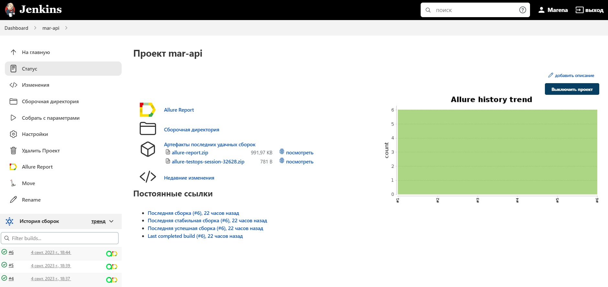
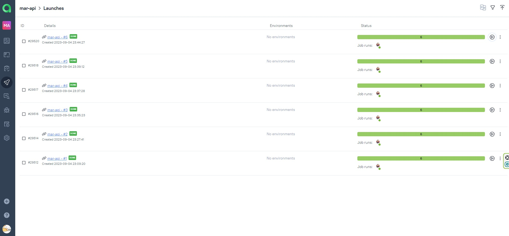
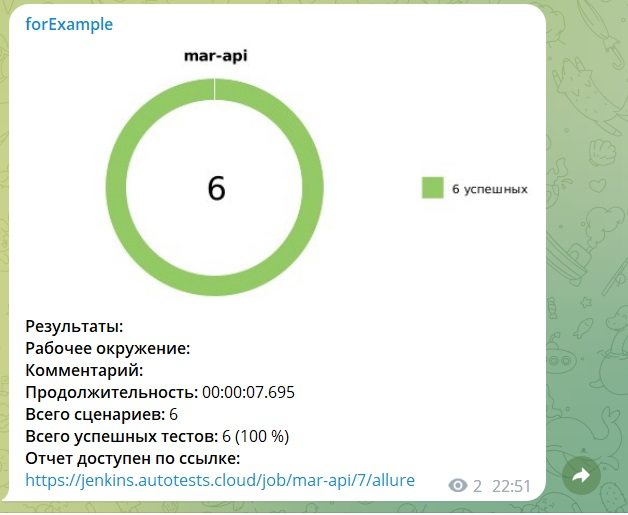

# Дипломный проект по автоматизации тестирования API сайта [reqres.in](https://reqres.in/)


## :bricks: Содержание

* <a href="#annotation">Описание проекта</a>
* <a href="#tools">Технологии и инструменты</a>
* <a href="#cases">Реализованные проверки</a>
* <a href="#console">Запуск тестов из терминала</a>
* <a href="#jenkins">Запуск тестов в Jenkins</a>
* <a href="#allure">Отчет о результатах тестирования в Allure Report</a>
* <a href="#allure-testops">Интеграция с Allure TestOps</a>
* <a href="#jira">Интеграция с Jira</a>
* <a href="#telegram">Уведомления в Telegram</a>

<a id="annotation"></a>
## :memo: Описание проекта
Проект направлен на тестирование интерфейса прикладной программы (API) сайта [reqres.in](https://reqres.in/) с целью убедиться, что интерфейс соответствует ожидаемой функциональности, безопасности, производительности и надежности.

Тесты в проекте выполняются путем отправки запросов к конечным точкам API и сравнения ответа с ожидаемыми результатами.

Разработанная тестовая документация охватывает две функциональности:
- <code>Пользовательские данные</code>
- <code>Регистрация пользователя</code>

Проект является дипломной работой по итогам обучения в школе автоматизации тестирования [qa.guru](https://qa.guru/) и выполнен с учетом полученных знаний и навыков:
- автотесты написаны на `Java` с использованием фреймворка `Selenide`
- тестовые данные сгенерированы с помощью `Java Faker`
- для работы с REST-службами на Java используется библиотека `Rest-assured`
- тестовая документация оформлена с использованием аннотаций `Allure`
- для получения информативной отчетности с вложениями подключены `Allure Reports` и `Allure TestOps`
- для отслеживания статусов заведенных задач и дефектов в багтрекере реализована интеграция `Allure TestOps` с `Jira`
- настроена отправка уведомлений в `Telegram` о результатах прохождения автотестов

<a id="tools"></a>
## :hammer_and_wrench: Технологии и инструменты

<p align="left">
<a href="https://www.java.com/"></a>
<a href="https://www.jetbrains.com/idea/"></a>
<a href="https://github.com/"></a>
<a href="https://junit.org/junit5/"></a>
<a href="https://gradle.org/"></a>
<a href="https://github.com/allure-framework/allure2"></a>
<a href="https://www.jenkins.io/"></a>
<a href="https://web.telegram.org/"></a>
<a href="https://qameta.io/"></a>
<a href="https://www.jira.com/"></a>
</p>

<code>Gradle</code> — для автоматизации сборки\
<code>JUnit5</code> — для выполнения тестов\
<code>REST Assured</code> — для тестирования REST-API сервисов\
<code>Jenkins</code> — CI/CD для запуска тестов удаленно\
<code>Allure Report</code> — для визуализации результатов тестирования\
<code>Allure TestOps</code> — как система управления тестированием\
<code>Jira</code> — как инструмент управления проектом и таск-трекер\
<code>Telegram Bot</code> — для уведомлений о результатах тестирования

<a id="cases"></a>
## :clipboard: Реализованные проверки

<code>Пользовательские проверки</code>
- Авторизация ранее зарегистрированного пользователя
- Получение информации о списке пользователей
- Создание пользователя с валидным именем и профилем деятельности
- Получение информации о существующем пользователе
- Удаление существующего пользователя

<code>Негативные проверки на регистрацию пользователя</code>
-  Регистрация пользователя без указания пароля

<a id="console"></a>
## :computer: Запуск тестов из терминала
### Локальный запуск тестов

```
gradle clean test
```
### Удаленный запуск тестов через Jenkins
```
clean api_test
```

<a id="jenkins"></a>
## </a> Запуск тестов в [Jenkins](https://jenkins.autotests.cloud/job/mar-api/)
Для запуска тестов в **Jenkins** необходимо нажать кнопку **Собрать с параметрами**, установить параметры сборки и кликнуть по кнопке **Собрать**

<p align="center">
  
</p>

После завершения прогона для просмотра будут доступны артефакты запуска и полезные ссылки для более детального изучения результатов прохождения тестов

<p align="center">
  
</p>

<a id="allure"></a>
## </a> Отчет о результатах тестирования в [Allure Report](https://jenkins.autotests.cloud/job/mar-api/6/allure/)

Одним из результатов сборки является **Allure Report**, в котором помимо просмотра итогового отчета на странице теста можно ознакомиться с пошаговым выполнением кода

<sub>Пример отображения итогового отчета</sub>
<p align="center">
  
</p>

<sub>Пример отображения результатов проверок в разрезе тестов</sub>
<p align="center">
  
</p>

<a id="allure-testops"></a>
## </a> Интеграция с [Allure TestOps](https://allure.autotests.cloud/project/3645/dashboards)

Реализованная в проекте интеграция с **Allure TestOps** позволяет не только ознакомиться с отчетом о результатах прохождения тестов, но и запускать автотесты и наблюдать за результатом их выполнения в режиме реального времени. При этом, возможности Allure TestOps позволяют выбирать, какие именно тесты запускать.

<sub>Пример отображения раздела Dashboard</sub>
<p align="center">
  
</p>

<sub>Пример отображения раздела Launches</sub>
<p align="center">
  
</p>

<a id="jira"></a>
## </a> Интеграция с [Jira](https://jira.autotests.cloud/browse/HOMEWORK-866)

Реализованная интеграция с **Jira** позволяет отслеживать статус заведенных задач и дефектов в багтрекере

<sub>Пример задачи, прилинкованной к тест-кейсам и прогону</sub>
<p align="center">
  
</p>

<a id="telegram"></a>
## </a> Уведомления в Telegram

После завершения прогона в Jenkins с помощью бота осуществляется отправка уведомления в **Telegram** о результатах прохождения тестов

<sub>Пример уведомления</sub>
<p align="left">
  
</p>